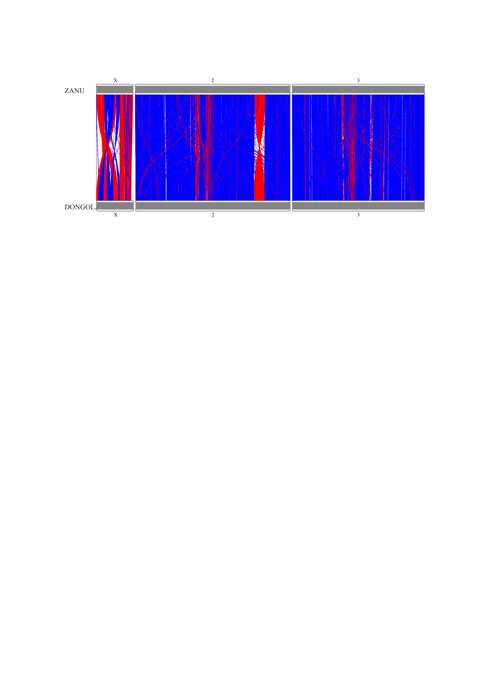

```{r setup, include=FALSE}
knitr::opts_chunk$set(echo = TRUE)
```
```{r}
Sys.setenv(LANG = "en")
```

## R Markdown

Solution to hw3 

#0. Installation of RIdeogram
```{r}
#install.packages("RIdeogram")
```

```{r}
library(RIdeogram)
library(dplyr)
library(tidyr)
```


#1. Read gene data
```{r echo=T, results='hide'}
gene_map <- read.csv('gene_mapping.tsv', sep='\t')
dong <- read.csv('DONGOLA_genes.tsv', sep='\t')
zanu <- read.csv('ZANU_genes.tsv', sep='\t')

head(gene_map)
```
```{r}
head(dong)
```
```{r}
head(zanu)
```

# 1. Preprocessing

## 1.1 Selecting required chromosomes in mapping data

### 1.1.1 For gene mapping ZANU 
```{r}
unique(gene_map$contig)
```
```{r}
chr_list = c('X', '2', '3')
gene_map <- gene_map[gene_map$contig %in% chr_list,]
unique(gene_map$contig)
```

### 1.1.2 For DONGOLA in gene_mapping(seq_id -> elem in chr_list)

#### 1.1.2.1 Process DONG column

```{r}
gene_map <- separate(data=gene_map, col=DONG, into=c("seq_id_dong", "mid_dong", 'strand_dong', 'len_dong', 'name_dong'), sep=",")
```

#### 1.1.2.2 Map seq_id of DONGOLA to chrososomes
```{r}
seq_id_map = data.frame(id=c('2',"3","X"), val=c('NC_053517.1', 'NC_053518.1', 'NC_053519.1'))

gene_map$seq_id_dong <- with(seq_id_map, id[match(gene_map$seq_id_dong, val)])

head(gene_map)
```
#### 1.1.2.3. Filter DONGOLA chromosomes
```{r}
gene_map <- gene_map[gene_map$seq_id_dong %in% chr_list,]
unique(gene_map$seq_id_dong)
```

## 1.2 Matching gene names in gene_map and in DONGOLA frames 
Removing "DONG_" from gene names in gene_map
```{r}
gene_map$name_dong <- gsub("DONG_", "", gene_map$name_dong)
```

# 2. Mapping ZANU to DONGOLA genes
Firstly, since we need 1 to 1, but there is 1 to many relation, we need distance to get the closest DONGOLA genes to a given ZANU gene

## 2.1 Distance calculation
```{r}
gene_map$dist <- abs(gene_map$middle.position - as.numeric(gene_map$mid_dong))

head(gene_map)
```
## 2.2 Drop duplicated ZANU gene names based on dist
```{r}
gene_map[gene_map$name == 'gene_10008', ]
```


```{r}
gene_map_dropped <- gene_map[order(gene_map['dist',])]
gene_map_dropped <- gene_map[!duplicated(gene_map$name),]

gene_map_dropped[gene_map_dropped$name == 'gene_10008', ]

```

```{r}
gene_map_dropped[gene_map_dropped$name == 'gene_10008', ]
```

# 3 Prepare tables (karyotype and synteny) for ideogram

## 3.1 Karyotype table

### 3.1.1 Template of data frame
```{r}
karyotype_table <- setNames(data.frame(matrix(ncol=7, nrow=0)), c("Chr", "Start", "End", "fill", "species", "size", "color"))

karyotype_table
```

### 3.1.2 Add ZENU data
```{r}
karyotype_table <- rbind(karyotype_table, data.frame(Chr=c('X','2','3'), Start=c(1, 1, 1), End=c(27238055, 114783175, 97973315), fill='969696', species='ZANU', size=12, color='252525'))

karyotype_table
```

### 3.1.3 Add DONGOLA data (lengths of chrs were googled)
```{r}
karyotype_table <- rbind(karyotype_table, data.frame(Chr=c('X','2','3'), Start=c(1, 1, 1), End=c(26910000, 111990000, 95710000), fill='969696', species='DONGOLA', size=12, color='252525'))

karyotype_table
```

## 3.2 Synteny table


```{r}
colnames(zanu) <- c('ID_1', 'Start_1', 'End_1', 'Strand_1')
colnames(dong) <- c('ID_2', 'Start_2', 'End_2', 'Strand_2')

synteny_table <- merge(gene_map_dropped, zanu, by.x='name', by.y='ID_1')
synteny_table <- merge(synteny_table, dong, by.x='name_dong', by.y='ID_2')
names(synteny_table)[names(synteny_table) == 'contig'] <- 'Species_1'
names(synteny_table)[names(synteny_table) == 'seq_id_dong'] <- 'Species_2'
synteny_table$Species_1[synteny_table$Species_1=='X'] <- 1
synteny_table$Species_1[synteny_table$Species_1=='2'] <- 2
synteny_table$Species_1[synteny_table$Species_1=='3'] <- 3
synteny_table$Species_2[synteny_table$Species_2=='X'] <- 1
synteny_table$Species_2[synteny_table$Species_2=='2'] <- 2
synteny_table$Species_2[synteny_table$Species_2=='3'] <- 3
synteny_table$Species_1 <- as.integer(synteny_table$Species_1)
synteny_table$Species_2 <- as.integer(synteny_table$Species_2)
head(synteny_table)
```

```{r}
blue_col <- '0000FF'
red_col <- 'FF0000'
dong_max_2 <- 111990000
dong_max_3 <- 95710000

map_func <- function(strand1, strand2){
  if (strand1 == strand2)
    return(red_col)
  return(blue_col)
}

#chr 2 and chr 3 need inversion
inv_func_fill <- function(chr1, strand1, strand2, prev_fill){
  if (chr1 == 2 || chr1 == 3){
    if (strand1 == strand2)
      return(red_col)
    return(blue_col)
  }
  return(prev_fill)
}

inv_func <- function(chr1, pos2){

  if (chr1 == 2 || chr1 == 3){
    if (chr1 == 2)
      return(dong_max_2 - pos2 + 1)
    return(dong_max_3 - pos2 + 1)
  }
  return(pos2)
}


synteny_table$fill <- mapply(map_func, synteny_table$Strand_1, synteny_table$Strand_2)

synteny_table$fill <- mapply(inv_func_fill, synteny_table$Species_1, synteny_table$Strand_1, synteny_table$Strand_2, synteny_table$fill)

synteny_table$Start_2 <- mapply(inv_func, synteny_table$Species_1, synteny_table$Start_2)

synteny_table$End_2 <- mapply(inv_func, synteny_table$Species_1, synteny_table$End_2)

synteny_table_cut <- synteny_table[c('Species_1', 'Start_1', 'End_1', 'Species_2', 'Start_2', 'End_2', 'fill')]


synteny_table_cut <- synteny_table_cut[synteny_table_cut$Species_1==synteny_table_cut$Species_2, ]

head(synteny_table_cut)
```

# 4. Plot

```{r}
ideogram(karyotype=karyotype_table, synteny=synteny_table_cut)
convertSVG("chromosome.svg", device="png")
```




